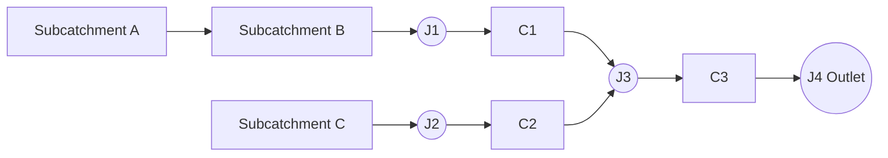

# SWMM Exercise (2026 class)

## Build a Stormwater Model from Scratch

### Objective

In this exercise you will build a complete **SWMM model from scratch** for a small urban drainage system.

The aim is **not** to produce a perfect design. The aim is to understand:

* how SWMM models are assembled
* how engineering assumptions are introduced
* how model outputs should be interpreted critically

Many parameters are intentionally not specified. You must make **reasonable engineering assumptions** and clearly document them.

# Learning outcomes

After completing this exercise you should be able to:

* create a **SWMM project in metric units**
* define **rainfall time series from design storms**
* create **subcatchments, nodes, conduits and an outlet**
* apply the **Green–Ampt infiltration model**
* correctly represent **catchment connectivity**
* run the model and assess whether the results are **physically reasonable**

# 1. Drainage system description

The system consists of three subcatchments:

* **A**
* **B**
* **C**

Runoff routing:

* **A drains to B**
* **B drains to J1**
* **C drains to J2**

Pipe network:

* **C1:** J1 → J3
* **C2:** J2 → J3
* **C3:** J3 → J4

Node **J4** is the **outlet**.

### Connectivity diagram

# 2. Subcatchment properties

| Subcatchment | Area (ha) | Width (m) | Slope (%) | Impervious (%) |
| ------------ | --------: | --------: | --------: | -------------: |
| A            |       1.2 |       110 |       1.2 |             55 |
| B            |       1.8 |       140 |       0.9 |             65 |
| C            |       1.0 |        90 |       1.5 |             45 |

You must choose reasonable values for:

* Manning's n (impervious)
* Manning's n (pervious)
* depression storage

Suggested starting values:

| Parameter                     | Suggested value |
| ----------------------------- | --------------- |
| Impervious Manning n          | 0.015           |
| Pervious Manning n            | 0.20            |
| Impervious depression storage | 1.5 mm          |
| Pervious depression storage   | 5 mm            |

These are **not mandatory**. They are starting assumptions.

# 3. Junctions and outlet

| Node        | Invert elevation (m) | Maximum depth (m) |
| ----------- | -------------------: | ----------------: |
| J1          |               101.20 |               2.0 |
| J2          |               101.00 |               2.0 |
| J3          |               100.40 |               2.0 |
| J4 (Outlet) |                99.80 |                 – |

Use a **free outfall** boundary condition at J4.

# 4. Conduit data

| Conduit | From | To | Length (m) |
| ------- | ---- | -- | ---------: |
| C1      | J1   | J3 |         85 |
| C2      | J2   | J3 |         75 |
| C3      | J3   | J4 |        120 |

Use circular pipes for C1 and C2. Rectangular option channel for C3. Pipes are concrete. Channel sections are Rubble lined on compacted clay. 

You must choose:

* pipe dimensions. 
* Manning's n for pipes

# 5. Rainfall input

Rainfall is derived from the **IDF relationships** below.

$$
Y = a X^{b}
$$

Where

* **X** = duration (hours)
* **Y** = rainfall intensity (mm/h)

| Return period | IDF relationship   |
| ------------- | ------------------ |
| 2 year        | Y = 59.526 X⁻⁰·⁷²⁷ |
| 5 year        | Y = 78.086 X⁻⁰·⁷⁰⁶ |
| 10 year       | Y = 90.356 X⁻⁰·⁶⁹⁸ |
| 25 year       | Y = 105.85 X⁻⁰·⁶⁹⁰ |
| 50 year       | Y = 117.34 X⁻⁰·⁶⁸⁶ |
| 100 year      | Y = 128.74 X⁻⁰·⁶⁸² |
| 200 year      | Y = 140.09 X⁻⁰·⁶⁷⁹ |

# 6. Design storms

Design storms were constructed using the **Alternating Block Method**.

Storm characteristics:

* **Duration:** 2 hours
* **Rainfall interval:** 15 minutes

### Rainfall depth per interval

| Time (min) | 2-year | 10-year | 50-year |
| ---------- | -----: | ------: | ------: |
| 0       |    2.9 |     4.9 |     6.6 |
| 15      |    3.7 |     6.3 |     8.5 |
| 30      |    5.8 |     9.5 |    12.8 |
| 45      |   40.8 |    59.4 |    75.9 |
| 60      |    8.5 |    13.8 |    18.5 |
| 75      |    4.5 |     7.5 |    10.1 |
| 90     |    3.2 |     5.5 |     7.4 |
| 105    |    2.6 |     4.4 |     6.0 |
| 120    |    0.0 |     0.0 |     0.0 |

Units: **mm per 15-minute interval**

### Total storm depth

| Return period | Total rainfall |
| ------------- | -------------- | 
| 2-year        | 71.9 mm        |
| 10-year       | 111.4 mm       |
| 50-year       | 145.9 mm       |

# 7. Infiltration model

Use the **Green–Ampt infiltration method**.

For this exercise assume the soil type is Loam.

### Green–Ampt soil parameters

| Soil texture    | Conductivity K (mm/h) | Suction head Ψ (mm) |  Porosity | Field capacity | Wilting point | Initial moisture deficit |
| --------------- | --------------------: | ------------------: | --------: | -------------: | ------------: | ------------------
| Sand            |                 120.4 |                49.0 |     0.437 |          0.062 |         0.024 |                    0.375 |
| Loamy Sand      |                  30.0 |                61.0 |     0.437 |          0.105 |         0.047 |                    0.332 |
| Sandy Loam      |                  10.9 |               110.0 |     0.453 |          0.190 |         0.085 |                    0.263 |
| Loam        |               3.3 |            88.9 | 0.463 |      0.232 |     0.116 |                0.231 |
| Silt Loam       |                   6.6 |               169.9 |     0.501 |          0.284 |         0.135 |                    0.217 |
| Sandy Clay Loam |                   1.5 |               220.0 |     0.398 |          0.244 |         0.136 |                    0.154 |
| Clay Loam       |                   1.0 |               210.1 |     0.464 |          0.310 |         0.187 |                    0.154 |
| Silty Clay Loam |                   1.0 |               270.0 |     0.471 |          0.342 |         0.210 |                    0.129 |
| Sandy Clay      |                   0.5 |               240.0 |     0.430 |          0.321 |         0.221 |                    0.109 |
| Silty Clay      |                   0.5 |               290.1 |     0.479 |          0.371 |         0.251 |                    0.108 |
| Clay            |                   0.3 |               320.0 |     0.475 |          0.378 |         0.265 |                    0.097 |

# 8. Tasks

## Task 1 — Build the SWMM model

Create a SWMM project with:

* subcatchments
* nodes (including outlet)
* conduits

Arrange the network clearly.

## Task 2 — Enter rainfall data

Create rainfall time series for:

* 2-year storm
* 10-year storm
* 50-year storm
  
Add a rain gauge. 

## Task 3 — Enter hydrological parameters

Assign:

* Green–Ampt infiltration
* Manning's roughness
* depression storage

Document all assumptions.

## Task 4 — Define the hydraulic network

Enter:

* node elevations
* conduit lengths
* pipe diameters

Use reasonable engineering estimates.

## Task 5 — Run the model

Run the simulation for each design storm.

Use a simulation period long enough to capture runoff recession. 

## Task 6 — Evaluate the results

Inspect:

* runoff hydrograph from each subcatchment
* flow in conduits C1, C2, C3
* water depth at junction J3
* outflow hydrograph at J4
* continuity error

Questions to consider:

* Does the timing of peaks make sense?
* Is J3 behaving as a critical junction?
* Which storm produces the largest peak discharge?

# 9. What to submit

### 1. SWMM model file

A working SWMM project file.

### 2. Assumption note

List the assumptions you made, including:

* pipe diameters
* Manning's n
* depression storage
* simplifications

### 3. Results summary

Include:

* peak discharge at outlet for each storm
* maximum depth at J3
* whether flooding occurred
* which storm is most critical

### 4. One figure

Include either:

* the model layout
  or
* hydrographs comparing the storms

# 10. Questions

1. Why does routing **A → B → J1** matter instead of routing A directly to a junction?
2. Why might **J3** be a critical node in this system?
3. Which parameter is likely to affect runoff more strongly: **imperviousness or pipe roughness**?
4. What additional data would you need if this were a real design project?
